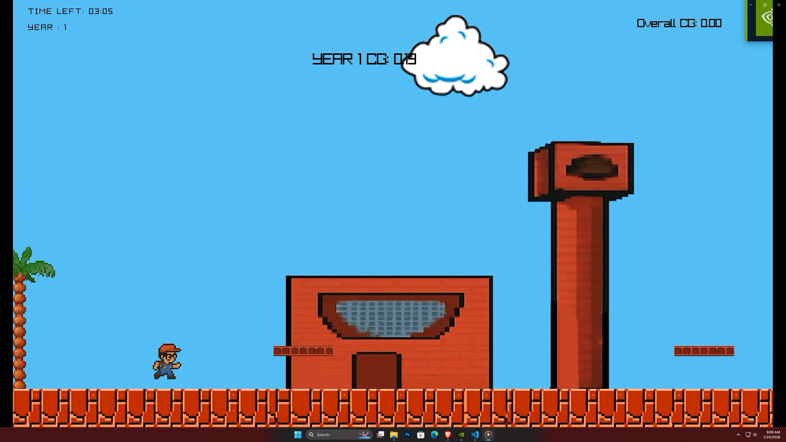
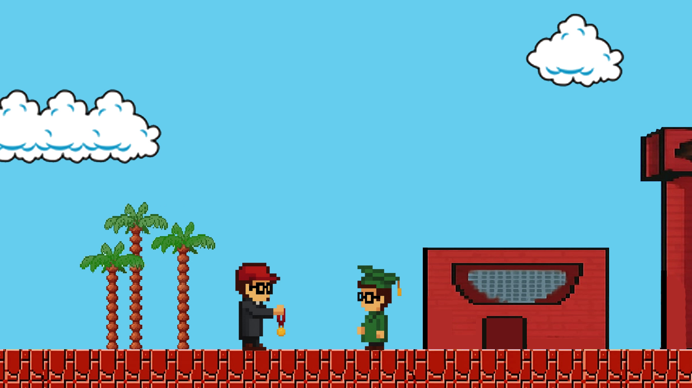
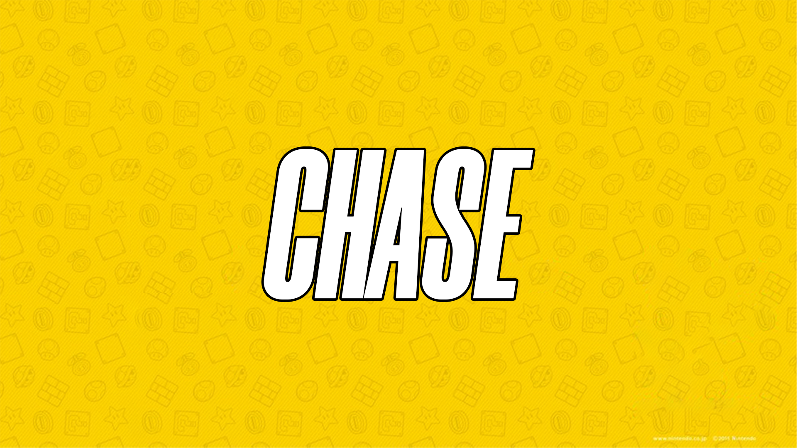

# CHASE

**CHASE** is a 2D side-scrolling platform runner game based on university life. The player must survive four academic years, collect academic items, avoid obstacles, maintain a good CGPA, and reach graduation.

The game features a pixel-art university theme, multiple characters, moving platforms, collectibles, obstacles, sound effects, background music, yearly progression, and a final graduation ceremony.

Download: https://mahir-labib.itch.io/partyjam

# Screenshots

  

  

  

## Built With

* C
* raylib
* raygui
* Pixel-art sprites
* MP3 and WAV audio
